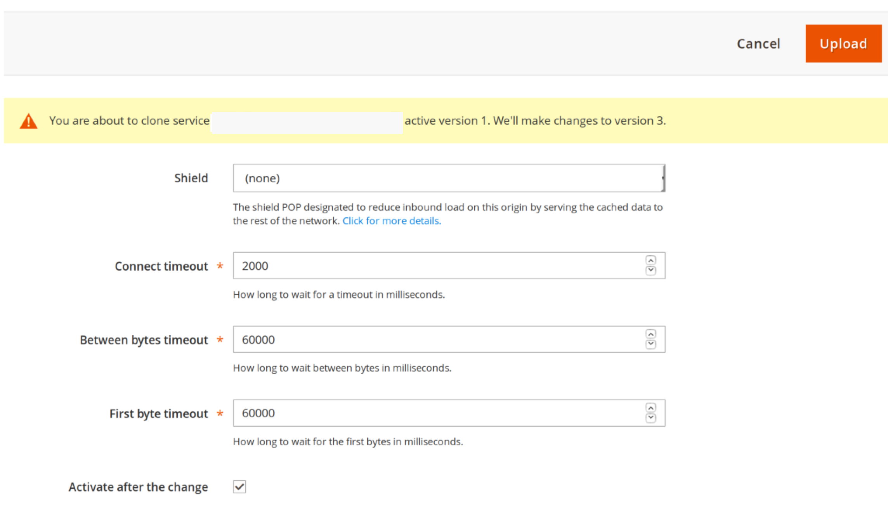
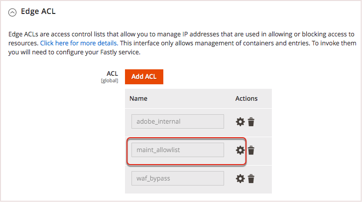

# 自定义缓存配置

在暂存环境和生产环境中设置和测试Fastly服务后，查看和自定义缓存配置设置。 例如，您可以更新设置以允许TLS将HTTP请求重定向到Fastly，更新清除设置以及启用基本身份验证以在开发期间对您的网站进行密码保护。

以下部分提供了配置某些缓存设置的概述和说明。 在中查找有关可用配置选项的其他信息 [用于Magento2的Fastly CDN模块](https://github.com/fastly/fastly-magento2/tree/master/Documentation) 文档。

## 强制TLS

Fastly提供 _强制TLS_ 用于将未加密请求(HTTP)重定向到Fastly的选项。 为您的暂存或生产环境配置了 [有效的SSL/TLS证书](fastly-configuration.md#provision-ssltls-certificates)，您可以更新存储的Fastly配置以启用强制TLS选项。 看飞天乐队 [强制TLS指南](https://github.com/fastly/fastly-magento2/blob/master/Documentation/Guides/FORCE-TLS.md) 在 _用于Magento2的Fastly CDN模块_ 文档。

>[!NOTE]
>
>对于云基础架构存储上的Adobe Commerce，建议启用强制TLS选项。

## 扩展Fastly超时

Fastly服务配置为发送给管理员的HTTPS请求指定180秒的默认超时时段。 任何超出超时期间的请求处理都会返回503错误。 因此，在响应需要较长时间处理的请求或尝试执行批量操作时，您可能会收到503错误。

要完成耗时超过3分钟的批量操作，请更改 _管理员路径超时_ value_可防止503错误。

>[!NOTE]
>
>要扩展Fastly UI中除“管理员”以外的其他Fastly超时参数，请参阅 [增加长时间作业的超时](https://github.com/fastly/fastly-magento2/blob/master/Documentation/Guides/Edge-Modules/EDGE-MODULE-INCREASE-TIMEOUTS-LONG-JOBS.md).

**延长管理员的Fastly超时**：

{{admin-login-step}}

1. 单击 **商店** >设置> **配置** > **高级** > **系统** 并展开 **全页缓存**.

1. 在 _Fastly配置_ 部分，展开 **高级配置**.

1. 设置 **管理员路径超时** 值（秒）。 此值不能超过10分钟（600秒）。

1. 单击 **保存配置** 页面顶部的。

1. 重新加载页面后，选择 **将VCL上传到Fastly** 在 _Fastly配置_ 部分。

Fastly检索用于生成VCL文件的管理员路径 `app/etc/env.php` 配置文件。

## 配置清除选项

Fastly在“Magento缓存管理”页面上提供了多种类型的清除选项，包括用于清除产品类别、产品资源和内容的选项。 启用后，Fastly会监视事件以自动清除这些缓存。 如果禁用清除选项，则可以在通过“高速缓存管理”页完成更新后手动清除快速高速缓存。

清除选项包括：

- **清除类别** — 在添加和更新单个产品时清除产品类别内容（而非产品内容）。 您可能希望将此项保持为禁用状态并启用清除产品，这将清除产品和产品类别。
- **清除产品** — 在保存对产品的单个修改时，清除所有产品和产品类别内容。 启用清除产品有助于在更改价格、添加产品选项以及产品库存缺货时立即向客户获取更新。
- **“清除CMS”页** — 在更新页面并将页面添加到Adobe Commerce CMS时清除页面内容。 例如，在更新条款和条件或退货策略时，您可能要清除该项。 如果您很少进行这些更改，则可以禁用自动清除。
- **软清除** — 根据过期时间将更改的内容设置为过期并清除。 除了过时的时间安排外，Fastly还会向客户提供过时的内容，并在后台更新内容。

**配置Fastly清除选项**：

1. 在 _Fastly配置_ 部分，展开 **高级配置** 以显示清除选项。

1. 对于每个清除选项，选择 **是** 启用自动清除，或者 **否** 禁用自动清除。

   禁用清除选项时，必须从以下位置手动清除该类别的高速缓存： _缓存管理_ 页面。

1. 单击 **保存配置** 页面顶部的。

1. 重新加载页面后，选择 **将VCL上传到Fastly** 在 _Fastly配置_ 部分。

有关更多信息，请参阅 [Fastly配置选项](https://github.com/fastly/fastly-magento2/blob/21b61c8189971275589219d418332798efc7db41/Documentation/CONFIGURATION.md#further-configuration-options).

## 配置GeoIP处理

Fastly模块包括GeoIP处理，用于自动重定向访客或提供与所获取的国家代码匹配的商店列表。 如果您已经使用扩展进行GeoIP处理，则可能需要使用Fastly选项验证功能。

**设置GeoIp处理**：

{{admin-login-step}}

1. 单击 **商店** >设置> **配置** > **高级** > **系统** 并展开 **全页缓存**.

1. 在 _Fastly配置_ 部分，展开 **高级配置**.

1. 向下滚动并选择 **是** 到 **启用GeoIP**. 将显示其他配置选项。

1. 对于GeoIP操作，如果访客自动重定向到，请选择 **重定向** 或提供了要从中进行选择的商店列表 **对话框**.

1. 对象 **国家/地区映射**，选择 **添加** 以输入两个字母的国家/地区代码来映射列表中的特定Adobe Commerce商店。

   

1. 单击 **保存配置** 页面顶部的。

1. 重新加载页面后，选择 **将VCL上传到Fastly** 在 _Fastly配置_ 部分。

>[!NOTE]
>
>当前的Adobe Commerce Fastly GeoIP模块实施不支持多个网站之间的重定向。

Fastly也提供了一系列 [与地理位置相关的VCL特征](https://developer.fastly.com/reference/vcl/variables/geolocation/) 用于自定义地理位置编码。

## 启用Fastly Edge模块

Fastly Edge Modules是一个灵活的框架，它允许通过模板定义UI组件和关联的VCL代码。 通过这些模块，可以轻松地通过用户界面自定义和扩展Fastly服务配置，而不用使用自定义VCL片段。

边缘模块允许您启用特定功能（如CORS标头、Cloud Sitemap重写），并配置Adobe Commerce存储与其他CMS或后端之间的集成。

要访问Edge Modules菜单以查看、配置和管理可用模块，请打开 _启用Fastly Edge模块_ 选项。 请参阅 [Fastly Edge模块](https://github.com/fastly/fastly-magento2/blob/master/Documentation/Guides/Edge-Modules/EDGE-MODULES.md) 在Fastly CDN模块文档中。

## 配置后端和源屏蔽

后端设置提供对Fastly性能的微调以及起源屏蔽和超时。 A _后端_ 是一个特定的位置（IP或域），配置了用于检查和提供缓存内容的Origin shield和超时设置。

_原点屏蔽_ 将存储的所有请求路由到特定的存在点(POP)。 在收到请求时，POP会检查缓存的内容并提供该内容。 如果未缓存，则将继续缓存Shield POP，然后缓存内容的原始服务器。 防护罩会减少直接流向原点的流量。

默认的Fastly VCL代码指定云基础架构网站上Adobe Commerce的原始屏蔽和超时默认值。 在某些情况下，您可能需要修改默认值。 例如，如果您遇到第一字节时间(TTFB)错误，您可能需要调整 _第一个字节超时_ 值。

>[!NOTE]
>
>如果您的网站要求通过后端集成（例如）进行功能交付 [Wordpress](fastly-vcl-wordpress.md)，自定义您的Fastly服务配置以添加后端并管理从Adobe Commerce商店到Wordpress的重定向。 有关详细信息，请参阅 [Fastly Edge模块 — 其他CMS/后端集成](https://github.com/fastly/fastly-magento2/blob/master/Documentation/Guides/Edge-Modules/EDGE-MODULE-OTHER-CMS-INTEGRATION.md) 在Fastly模块文档中。

**查看后端设置配置**：

{{admin-login-step}}

1. 单击 **商店** >设置> **配置** > **高级** > **系统** 并展开 **全页缓存**.

1. 展开 **Fastly配置** 部分。

1. 展开 **后端设置** 并选取齿轮以检查默认后端。 此时将打开一个模式窗口，其中显示当前设置以及更改这些设置的选项。

   

1. 选择 **屏蔽** 位置（或数据中心）。

   项目的默认Fastly配置会将位置设置为最接近您的云服务区域。 如果需要对其进行更改，请选择靠近默认位置的位置。

1. 修改与屏蔽连接的超时值（以微秒为单位）、字节之间的时间和第一个字节的时间。 我们建议保留默认超时设置。

1. （可选）选择以 **在编辑或保存后激活后端和Shield**.

1. 单击 **上传** 保存更改并将其上传到Fastly服务器。

1. 在管理员中，选择 **保存配置**.

欲了解更多信息，请参见 [后端设置指南](https://github.com/fastly/fastly-magento2/blob/21b61c8189971275589219d418332798efc7db41/Documentation/Guides/BACKEND-SETTINGS.md) 在Fastly模块文档中。

## 基本身份验证

基本身份验证是一项使用用户名和密码保护网站上每个页面和资产的功能。 三 **不推荐** 在生产环境中激活基本身份验证。 您可以在暂存环境中对其进行配置，以在开发过程中保护您的站点。 请参阅 [基本身份验证指南](https://github.com/fastly/fastly-magento2/blob/master/Documentation/Guides/BASIC-AUTH.md) 在Fastly CDN模块文档中。

如果添加用户访问权限并在暂存环境中启用基本身份验证，则您仍然可以访问管理员，而无需其他凭据。

## 创建自定义VCL代码段

Fastly支持自定义版本的Varnish Configuration Language (VCL)以自定义Fastly服务配置。 例如，您可以使用带有边缘和访问控制列表(ACL)字典的VCL代码块来允许、阻止或重定向特定用户或IP地址的访问。

有关创建自定义VCL片段、Edge词典和ACL的说明，请参见 [自定义Fastly VCL片段](fastly-vcl-custom-snippets.md).

>[!NOTE]
>
>在将自定义VCL代码、边缘词典和ACL添加到Fastly模块配置之前，请验证Fastly缓存服务是否可与默认配置配合使用。 请参阅 [设置Fastly](fastly-configuration.md).

## 管理域

对于Starter和Pro项目，您可以使用 [!UICONTROL Domains] 用于为存储添加和管理Fastly域配置的选项。

- 对于入门项目，请转到下的项目URL [!UICONTROL Domains] 选项卡 [!DNL Cloud Console] 以添加项目URL。

- 对于Pro项目，请提交 [Adobe Commerce支持票证](https://experienceleague.adobe.com/docs/commerce-knowledge-base/kb/help-center-guide/magento-help-center-user-guide.html#submit-ticket) 以将域添加到您的云项目配置。 支持团队还更新Adobe Commerce Fastly帐户配置以添加域。

**从管理员管理Fastly域配置**：

{{admin-login-step}}

1. 选择 **商店** >设置> **配置** > **高级** > **系统** 并展开 **全页缓存**.

1. 在Admin _Fastly配置_ 部分，选择 **域**.

1. 单击 **管理域** 以打开“域”页面。

1. 在云环境中添加商店的顶级和子域名。

   您只能指定已添加到云基础架构配置的域。

   

1. 单击 **激活** 以更新Fastly域配置。

>[!NOTE]
>
>如果已在另一个Fastly帐户上配置了同一域，则必须先提交Adobe Commerce支持工单以请求域委派，然后才能将域添加到Adobe Commerce。 请参阅 [多个Fastly帐户和分配的域](fastly.md#multiple-fastly-accounts-and-assigned-domains).

## 启用维护模式

使用 _维护模式_ 选项，允许在返回所有其他请求的错误页面时，从指定的IP地址对您的站点进行管理访问。

**启用具有管理访问权限的维护模式**：

1. 打开 _Fastly配置_ 部分。

1. 在 _边缘ACL_ 部分，更新 `maint_allow` 具有管理IP地址的访问控制列表(ACL)，可在存储处于维护模式时访问存储。

   

1. 在 _维护模式_ 部分，选择 **启用维护模式**.

   启用维护模式后，将阻止所有流量，但来自 `maint_allowlist` ACL 您可以更新 `maint_allowlist` 更改ACL中的IP地址。

   有关详细的配置说明，请参见 [维护模式指南](https://github.com/fastly/fastly-magento2/blob/master/Documentation/Guides/MAINTENANCE-MODE.md) 在Fastly CDN forMagento2模块文档中。
