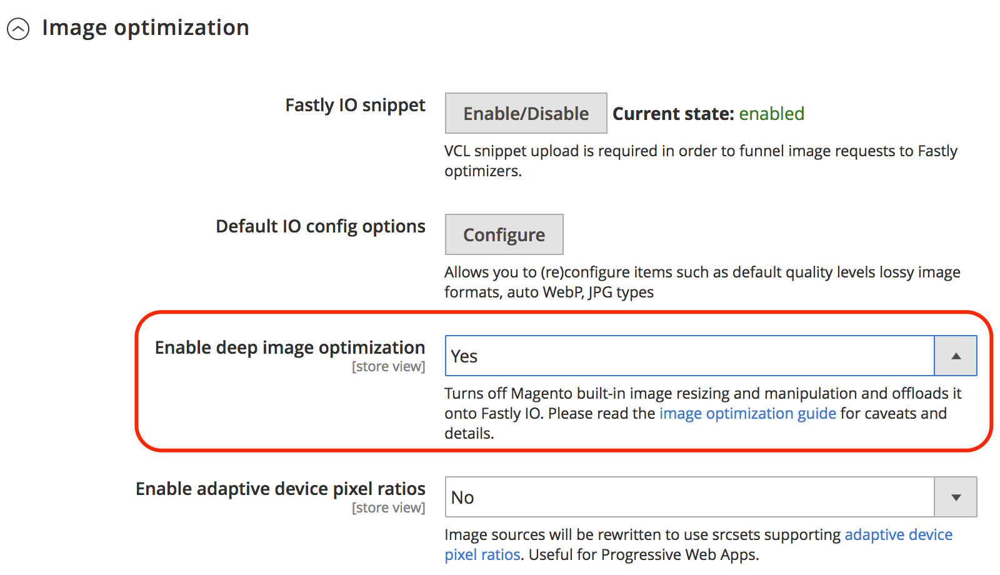

# Fastly图像优化

Fastly图像优化(Fastly IO)提供实时图像处理和优化，以加快图像投放并简化响应式Web应用程序的图像源集的维护。 配置Fastly IO后，可提供以下映像优化功能：

- 强制有损转换
- 深度图像优化
- 自适应像素比
- 支持常见图像格式：PNG、JPEG、GIF和WebP

在启用和配置Fastly IO选项之前，必须设置Fastly服务并配置原始屏蔽。

根据您的配置设置，Fastly图像优化(Fastly IO)代码片段插入VCL代码以执行图像优化，从而加快店面中的产品图像交付。 配置Fastly IO有三个步骤：启用、配置和验证。

## 启用Fastly IO

通过上传Fastly IO VCL片段，从管理员面板启用Fastly图像优化(Fastly IO)。 此代码片段提供了Fastly配置说明，以便使用默认配置通过图像优化器处理所有图像。

**先决条件：**

- 安装或升级到Fastly模块版本1.2.62或更高版本
- [配置Fastly Origin屏蔽和后端](fastly-custom-cache-configuration.md#configure-back-ends-and-origin-shielding)

**启用Fastly IO**：

1. 登录到您的本地 [管理员](../../get-started/onboarding.md#access-your-admin-panel) 以管理员身份查看该面板。

1. 选择 **商店** > **设置** > **配置** > **高级** > **系统**.

1. 在右窗格中，展开 **全页缓存**.

1. 选择 **Fastly配置** > **图像优化** 以指定配置设置。

1. 在 _Fastly IO片段_ 字段，选择 **启用/禁用**.

1. 上传Fastly IO片段：

   - 选择 **默认IO配置选项** 以打开图像优化默认配置选项页面。
   - 选择 **上传** 将VCL代码片段上载到服务器。

## 配置Fastly IO

根据需要查看和更新映像优化的默认IO配置设置。 例如，您可能希望更改有损格式的WebP和JPEG质量级别，或将提供JPEG图像的格式更改为 _渐进式_ 或 _基线_. 此外，您可以使用Fastly IO实现更精细的图像优化功能，例如：

- 强制有损转换
- 深度图像优化
- 自适应像素比

**更新Fastly IO**：

1. 在 _Fastly配置_ 中的页面 _默认IO配置选项_ 字段，选择 **配置**.

   

1. 查看并更新Fastly IO配置设置 _图像优化默认配置选项_ 页面：

   

   - **自动WebP？** — 保留默认设置(`Yes`)，以便在支持图像的浏览器中将图像转换为WebP格式。 如果将设置更改为 **否**，Fastly使用图像文件类型，而不是将图像转换为WebP格式。

   - **默认WebP（有损）质量** — 保留默认设置(`85`)或键入有损文件格式图像的压缩级别。 您可以指定从1到100的任何整数。

   - **默认JPEG格式控件**  — 保留默认设置(`Auto`)，或选择在提供图像时要使用的JPEG类型。 如果将该值设置为 _自动_，Fastly提供输出类型与输入类型匹配的图像。 选择 _基线_ 以从左上到右下逐行显示图像。 选择 _渐进式_ 显示加载时变得清晰的模糊图像。

   - **默认JPEG质量** — 保留默认设置(`85`)或键入有损文件格式质量的压缩级别。 指定从1到100的任意整数。

   - **是否允许升级？** — 保留默认设置(`No`)，或选择 `Yes` 返回比原始源文件大的图像，以使其适合所请求的尺寸。

   - **调整筛选器大小** — 保留默认设置(`Lancsoz3`)，或选择替代项。 此设置指定用于传送调整大小的图像的滤镜。 根据所选滤镜，调整大小后的图像可以具有更高或更低的像素数。

      - `Lanczos3` （默认） — 提供最佳质量的图像。 它可以增强检测图像中的边缘和线性特征的能力，并使用 _[!DNL sinc]_重新取样，以提供最佳重建。
      - `Lanczos2` — 使用与相同的筛选器 `Lancsoz3` 但用更不精确的 _[!DNL sinc]_重新取样函数。
      - `Bicubic` — 在缩小图像时具有自然锐化效果。
      - `Bilinear` — 在放大图像时具有自然的平滑效果。
      - `Nearest` — 在调整像素图稿大小时具有自然的像素化效果。

1. 为Fastly服务指定IO配置设置后，选择 **取消** 以返回Fastly配置设置。

1. 在图像优化配置中 _启用深层图像优化_ 字段，选择 **是** 以启用深层图像优化。

   

   默认情况下，深度图像优化处于关闭状态。 启用此功能后，Adobe Commerce中的内置调整大小功能将关闭，并且调整大小的工作将卸载到Fastly IO服务。 图像优化仅适用于产品图像。 CMS图像不调整大小。 请参阅 [Fastly文档](#deep-image-optimization).

1. 启用深层图像优化后，启用 [自适应像素比](#adaptive-pixel-ratios) 生成图像并优化用于响应式网站的功能。

   

   - 在 _启用自适应设备像素比_ 字段，选择 **是**.
   - 在 _设备像素比_ 字段，接受默认设置，或选择 **系统输入** 复选框以移除设置。 然后，选择所需的比率。 设备像素比设置越高，生成的图像越大。

1. 选择 **保存配置**.

### 强制有损转换

默认情况下，Fastly IO服务强制将无损格式（如PNG、BMP或WEBP）转换为JPEG/WEBP格式。

强制有损转换的好处是提供的图像更小。
例如，通过使用JPEG或WEBp格式而不是PNG，大小可能会减少60%到70%，具体取决于Fastly IO配置中指定的质量级别。

根据为图像优化选择的质量级别，您可能会看到图像中的视觉差异。 例如，Alpha通道/透明度会被去除，并替换为白色背景，除非您使用使用使用主题的背景颜色的深度图像优化。

如果您关闭有损转换(`WebP Auto? = No`)，Fastly IO只为兼容的浏览器将JPEG图像更改为WEBP格式。 不会更改其他图像类型。 例如，如果原始图像为PNG，则Fastly IO服务的输出为PNG。

### 深度图像优化

默认情况下，深度图像优化处于关闭状态。 启用此选项会关闭内置的Adobe Commerce大小调整并将其完全卸载到Fastly IO服务。
此功能仅调整大小 _产品_ 图像。 CMS图像不调整大小。

启用深度图像优化会向每个图像添加背景颜色定义，如主题中所定义。 结果，WebP图像从WebP无损切换到WebP有损。 无损和有损之间的主要区别之一是，有损丢弃来自PNG图像的Alpha通道，这可提供小得多的图像。 但是，在使用不同背景的产品和促销活动页面上，具有透明度的图像可能会看起来很奇怪。

例如，以下代码表示Luma主题中图像的原始源：

```html

```

启用Fastly IO深度图像优化功能后，将重写图像的原始源代码，如以下示例所示：

```html

```

### 自适应像素比

自适应像素比功能对于优化渐进式Web应用程序的图像非常有用。 它允许您通过添加 `srcset` 每个产品图像。

启用自适应像素比功能后，Fastly IO服务将提供一个可以适应变化的固定宽度图像 `device-pixel-ratios`.
例如，服务修改了产品图像定义，如以下示例所示：

```html

```

请参阅 `srcset` [浏览器支持](https://caniuse.com/#feat=srcset) 和 [规范](https://html.spec.whatwg.org/multipage/embedded-content.html#attr-img-srcset).

## 验证Fastly IO

启用和配置Fastly IO后，无论是否启用Fastly IO，都可通过执行网页速度测试来验证配置。 此外，检查存储中的图像以检查图像大小和外观是否存在问题。
